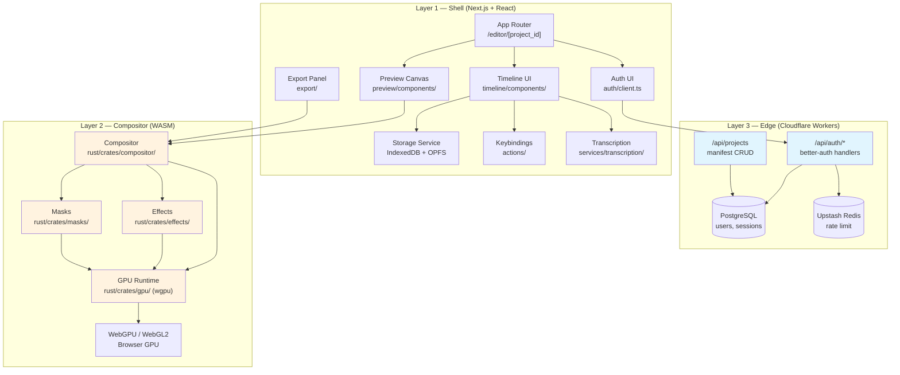
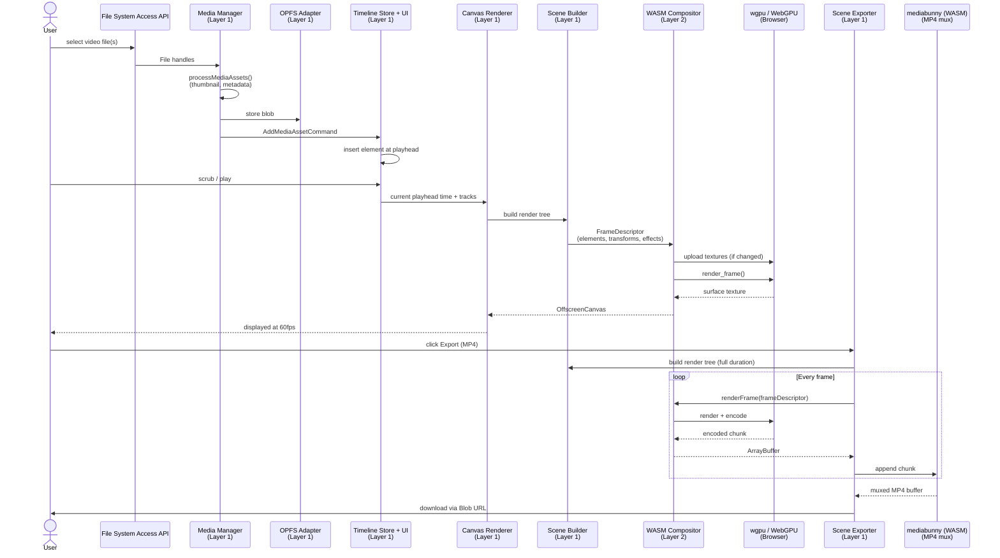

# OpenCut — Architecture Design Document

## 1. Overview

This document maps every Functional Requirement (FR-001–FR-013) and Non-Functional Requirement (NFR-001–NFR-006) to concrete modules, files, and architectural boundaries in the OpenCut codebase. It extends [ADR-001](./01-ADRs/ADR-001-initial-architecture.md) with ground-truth verification of source paths and defines the API contracts, data models, and security boundaries required for implementation.

---

## 2. Layered Architecture

OpenCut retains the 3-layer architecture from ADR-001:

| Layer | Name | Runtime | Responsibility |
|-------|------|---------|---------------|
| 1 | Shell UI | Next.js 16 + React 19 + TypeScript | Routing, timeline UI, preview canvas mount, export orchestration, auth flows, storage |
| 2 | Compositor | Rust → WASM (`wasm-pack`, `wasm-bindgen`) | GPU-accelerated frame compositing, effects, masks, text rendering |
| 3 | Edge API | Cloudflare Workers (`@opennextjs/cloudflare`) | Auth endpoints, project manifest CRUD, no video data |

---

## 3. FR → Module Mapping

### 3.1 Verified Source Paths

All paths below were verified to exist in the working tree at commit `1e4e2ff6`.

| FR | Requirement | Module | Key Files / Dirs | Layer |
|----|-------------|--------|-----------------|-------|
| FR-001 | WASM Compositor | `opencut-wasm` | `rust/wasm/`, `rust/crates/compositor/`, `rust/crates/gpu/` | 2 |
| FR-002 | Timeline Editing | Timeline UI + State | `apps/web/src/timeline/`, `apps/web/src/core/managers/timeline-manager.ts` | 1 |
| FR-003 | Canvas Preview | Preview Canvas | `apps/web/src/preview/`, `apps/web/src/services/renderer/canvas-renderer.ts` | 1 ↔ 2 |
| FR-004 | Media Ingestion | File System Access API + Media Manager | `apps/web/src/media/`, `apps/web/src/core/managers/media-manager.ts` | 1 |
| FR-005 | Effects Pipeline | Effects crate + definitions | `rust/crates/effects/`, `apps/web/src/effects/`, `apps/web/src/services/renderer/nodes/effect-layer-node.ts` | 2 |
| FR-006 | Mask Compositing | Masks crate | `rust/crates/masks/`, `apps/web/src/preview/components/mask-handles.tsx` | 2 |
| FR-007 | Text & Graphics Overlays | Text/Graphics engine | `apps/web/src/text/`, `apps/web/src/graphics/`, `apps/web/src/services/renderer/nodes/text-node.ts`, `graphic-node.ts` | 1 ↔ 2 |
| FR-008 | MP4 Export | Export pipeline | `apps/web/src/export/`, `apps/web/src/services/renderer/scene-exporter.ts` | 1 |
| FR-009 | Authentication | Auth + DB | `apps/web/src/auth/`, `apps/web/src/db/`, `apps/web/src/app/api/auth/[...all]/route.ts` | 3 |
| FR-010 | Project Persistence | Storage Service | `apps/web/src/services/storage/`, `apps/web/src/services/storage/indexeddb-adapter.ts`, `opfs-adapter.ts` | 1 |
| FR-011 | Auto-Captions | Transcription service | `apps/web/src/transcription/`, `apps/web/src/services/transcription/service.ts`, `worker.ts` | 1 |
| FR-012 | Keybindings | Actions registry | `apps/web/src/actions/`, `apps/web/src/actions/registry.ts`, `keybindings-store.ts` | 1 |
| FR-013 | Cloudflare Deploy | Edge deployment | `apps/web/wrangler.jsonc`, `apps/web/Dockerfile`, `apps/web/open-next.config.ts` | 3 |

### 3.2 Module Details

#### FR-001 — WASM Compositor (`rust/wasm/` + `rust/crates/`)

The compositor is compiled from the `opencut-wasm` crate at `rust/wasm/`. It re-exports bindings from four sub-modules:

- `compositor.rs` — Frame rendering pipeline (`initCompositor`, `resizeCompositor`, `renderFrame`, `uploadTexture`, `releaseTexture`)
- `effects.rs` — GPU effect passes (`applyEffectPasses`)
- `masks.rs` — JFA feathered masking (`applyMaskFeather`)
- `perf.rs` — Performance timing markers for WASM internals

Internal crates (no direct JS exposure):
- `rust/crates/compositor/` — `Compositor::render_frame()`, timeline-to-GPU translation
- `rust/crates/effects/` — `Effects::apply()`, shader dispatch
- `rust/crates/masks/` — `Masks::apply_mask_feather()`, JFA compute pipeline
- `rust/crates/gpu/` — `wgpu` context abstraction (surface, texture, buffer management)
- `rust/crates/time/` — Shared time primitives (`Timestamp`, `Duration`)
- `rust/crates/bridge/` — TypeScript type generation via `tsify-next`

#### FR-002 — Timeline Editing (`apps/web/src/timeline/`)

The timeline is a React component tree driven by imperative controllers:

- `timeline/components/index.tsx` — Root `Timeline` component (~950 LOC). Renders ruler, tracks, playhead, and handles scroll/zoom/snapping.
- `timeline/timeline-store.ts` — Zustand store for UI state (snapping, ripple editing, expanded elements). Persisted to `localStorage`.
- `timeline/hooks/` — 10+ hooks for playhead, seek, zoom, drag-drop, resize, selection, edge auto-scroll.
- `timeline/controllers/` — Imperative controllers consumed by hooks (playhead, seek, drag-drop, zoom, element interaction, resize, keyframe drag).
- `core/managers/timeline-manager.ts` — Canonical timeline state manager (scenes, tracks, elements).
- `commands/timeline/` — Command-pattern wrappers for undo/redo (`AddElementCommand`, `RemoveElementCommand`, `MoveElementCommand`, `SplitElementCommand`, etc.).

#### FR-003 — Canvas Preview (`apps/web/src/preview/`)

- `preview/components/index.tsx` — `PreviewPanel` + `PreviewCanvas`. Mounts the compositor output canvas, drives RAF loop.
- `preview/components/preview-interaction-overlay.tsx` — Pointer surface delegating to `PreviewInteractionController`.
- `preview/components/transform-handles.tsx`, `mask-handles.tsx`, `text-edit-overlay.tsx` — Overlay UIs for direct manipulation.
- `services/renderer/canvas-renderer.ts` — Bridge between React and WASM: calls `renderFrame()` with the current `FrameDescriptor`, mounts the returned canvas into the DOM.
- `services/renderer/scene-builder.ts` — Builds the render tree (`RootNode`) from `TimelineTrack` + `MediaAsset` state.

#### FR-004 — Media Ingestion (`apps/web/src/media/`)

- `media/use-file-upload.ts` — File picker + drag-and-drop hook.
- `media/use-paste-media.ts` — Clipboard paste listener for media files.
- `media/processing.ts` — `processMediaAssets()`: generates thumbnails, extracts metadata (duration, dimensions, codec) via `mediabunny`.
- `core/managers/media-manager.ts` — In-memory asset registry. Assets are stored as `FileSystemHandle`-backed blobs in OPFS (`services/storage/opfs-adapter.ts`).
- **Zero-upload invariant:** No `fetch()` call ever transmits video bytes. Assets move from native File Picker → OPFS via the File System Access API.

#### FR-005 — Effects Pipeline (`rust/crates/effects/` + `apps/web/src/effects/`)

- `rust/crates/effects/` — `Effects::apply()` runs a chain of `EffectPass` compute shaders on `wgpu`.
- `apps/web/src/effects/definitions/` — UI param definitions for each effect (e.g., blur).
- `apps/web/src/effects/registry.ts` — Client-side effect catalog.
- `services/renderer/nodes/effect-layer-node.ts` — Render tree node that wraps a visual node with an effect layer before compositing.

#### FR-006 — Mask Compositing (`rust/crates/masks/`)

- `rust/crates/masks/` — `Masks::apply_mask_feather()` implements Jump Flood Algorithm (JFA) for GPU-accelerated feathered masking.
- `apps/web/src/preview/components/mask-handles.tsx` — UI for editing mask shape and feather radius.
- Bound to Layer 2 because the heavy compute (JFA multi-pass) runs entirely in WASM/WebGPU.

#### FR-007 — Text & Graphics Overlays

**Text:** `apps/web/src/text/`
- `text/primitives.ts` — Layout engine: `measureTextLayout()`, `drawMeasuredTextLayout()`.
- `text/measure-element.ts` — Animated background param resolution + visual rect computation.
- `services/renderer/nodes/text-node.ts` — Render node that draws measured text with transforms/effects.

**Graphics:** `apps/web/src/graphics/`
- `graphics/definitions/` — Rectangle, ellipse, polygon, star renderers.
- `graphics/registry.ts` — Shape definition catalog.
- `services/renderer/nodes/graphic-node.ts` — Render node that caches shape source canvas and applies it as a visual node.

**Stickers:** `apps/web/src/stickers/`
- `stickers/providers/` — Flag/logo/shape asset catalogs.
- `services/renderer/nodes/sticker-node.ts` — Sticker render node.

#### FR-008 — MP4 Export (`apps/web/src/export/` + `services/renderer/scene-exporter.ts`)

- `export/index.ts` — Types: `ExportFormat`, `ExportQuality`, `ExportOptions`, `ExportResult`.
- `export/defaults.ts` — Default MP4/high-quality settings.
- `services/renderer/scene-exporter.ts` — `SceneExporter` class. Drives compositor frame-by-frame, collects encoded chunks via `mediabunny` (`Mp4OutputFormat` / `WebMOutputFormat`), muxes audio, emits progress/complete/error/cancel events.
- `components/editor/export-button.tsx` — UI popover with format/quality toggles and progress indicator.
- **Zero-egress invariant:** The export buffer is created client-side and downloaded via `URL.createObjectURL()`. No server endpoint is involved.

#### FR-009 — Authentication (`apps/web/src/auth/` + `apps/web/src/db/`)

- `auth/server.ts` — `better-auth` server config with Drizzle PostgreSQL adapter, Upstash Redis rate-limit storage.
- `auth/client.ts` — `better-auth` React client (`signIn`, `signUp`, `useSession`).
- `db/index.ts` — Drizzle ORM initialization (`postgres-js`).
- `db/schema.ts` — Tables: `users`, `sessions`, `accounts`, `verifications`, `feedback`. All with RLS policies.
- `app/api/auth/[...all]/route.ts` — Next.js catch-all route delegating to `better-auth` handlers.

#### FR-010 — Project Persistence (`apps/web/src/services/storage/`)

- `services/storage/indexeddb-adapter.ts` — Generic IndexedDB wrapper (`get`, `set`, `remove`, `list`, `getAll`, `clear`).
- `services/storage/opfs-adapter.ts` — Origin Private File System adapter for raw media `File` blobs.
- `services/storage/service.ts` — `StorageService` singleton. Orchestrates:
  - Projects → IndexedDB store `video-editor-projects`
  - Media metadata → per-project IndexedDB `video-editor-media-{projectId}`
  - Media file blobs → per-project OPFS `media-files-{projectId}`
  - Saved sounds → IndexedDB `video-editor-saved-sounds`
- `services/storage/migrations/` — 31 versioned migrations (v0→v1 … v30→v31) with transformers and tests.
- `services/storage/use-storage-persistence.ts` — Prompts for `navigator.storage.persist()` (Firefox durability).

#### FR-011 — Auto-Captions (`apps/web/src/transcription/`)

- `services/transcription/service.ts` + `worker.ts` — WebWorker-based on-device STT via `@huggingface/transformers`.
- `transcription/caption.ts` — `buildCaptionChunks()` splits transcription segments into timed cues.
- `subtitles/insert.ts` — `insertCaptionChunksAsTextTrack()` creates timeline text elements from cues.
- **Zero-egress invariant:** Audio is decoded locally and fed to the transformers model in a WebWorker. No audio bytes leave the browser.

#### FR-012 — Keybindings (`apps/web/src/actions/`)

- `actions/registry.ts` — Global action bus (`bindAction`, `unbindAction`, `invokeAction`).
- `actions/definitions.ts` — Canonical action catalog: `toggle-play`, `split`, `delete-selected`, `undo`, `redo`, `seek-forward`, etc.
- `actions/keybindings-store.ts` — Zustand store (persisted to `localStorage` as `opencut-keybindings`). Supports Apple/QWERTY/AZERTY layouts.
- `actions/use-keybindings.ts` — Global `keydown` listener (capture phase). Resolves key → action and calls `invokeAction()`.
- `actions/use-editor-actions.ts` — Binds all editor-level handlers (playback, editing, selection, history).

#### FR-013 — Cloudflare Edge Deployment

- `wrangler.jsonc` — Cloudflare Workers config (`nodejs_compat`, `global_fetch_strictly_public`, self-referential service binding).
- `open-next.config.ts` — `@opennextjs/cloudflare` adapter config.
- `Dockerfile` — Container image for the web app (used in Docker Compose dev stack, not the Cloudflare target).
- `next.config.ts` — Next.js 16 config with Turbopack.

---

## 4. Component Diagram



---

## 5. Sequence Diagram — Critical Path: Import → Timeline → Preview → Export



---

## 6. WASM API Contract

### 6.1 Entry Points (`wasm_bindgen` exports)

All functions are exported from the `opencut-wasm` package (`rust/wasm/pkg/`).

| Function | Signature (TypeScript) | Purpose |
|----------|----------------------|---------|
| `initCompositor` | `(width: number, height: number) => void` | Create canvas + wgpu surface, initialize `Compositor` runtime. |
| `resizeCompositor` | `(width: number, height: number) => void` | Resize surface to match output dimensions. |
| `getCompositorCanvas` | `() => HTMLCanvasElement` | Return the canvas backing the compositor surface (mount into DOM). |
| `uploadTexture` | `(options: UploadTextureOptions) => void` | Import an `OffscreenCanvas` into the compositor texture cache keyed by `id`. |
| `releaseTexture` | `(id: string) => void` | Drop a texture from the compositor cache. |
| `renderFrame` | `(options: FrameDescriptor) => void` | Composite one frame to the surface. Auto-resizes surface if `frame.width/height` changed. |
| `applyEffectPasses` | `(options: ApplyEffectPassesOptions) => OffscreenCanvas` | Run a chain of effect compute shaders on a source image. Returns a new `OffscreenCanvas`. |
| `applyMaskFeather` | `(options: ApplyMaskFeatherOptions) => OffscreenCanvas` | Apply JFA feather to a mask image. Returns a new `OffscreenCanvas`. |

### 6.2 Type Contracts

```typescript
// UploadTextureOptions
interface UploadTextureOptions {
  id: string;
  source: OffscreenCanvas;
  width: number;
  height: number;
}

// FrameDescriptor (simplified — full spec in rust/crates/compositor/src/)
interface FrameDescriptor {
  width: number;
  height: number;
  elements: FrameElement[];
}

interface FrameElement {
  id: string;
  type: "video" | "image" | "text" | "graphic" | "sticker";
  transform: Transform2D;
  opacity: number;
  source?: string; // texture id
}

// ApplyEffectPassesOptions
interface ApplyEffectPassesOptions {
  source: OffscreenCanvas;
  width: number;
  height: number;
  passes: EffectPassInput[];
}

interface EffectPassInput {
  shader: string;
  uniforms: { name: string; value: number[] }[];
}

// ApplyMaskFeatherOptions
interface ApplyMaskFeatherOptions {
  mask: OffscreenCanvas;
  width: number;
  height: number;
  feather: number;
}
```

### 6.3 Lifecycle Rules

1. **Initialization order:** `initCompositor()` must be called before any `renderFrame()`, `uploadTexture()`, or `apply*()` call.
2. **Texture lifetime:** `uploadTexture()` caches textures in compositor memory. Call `releaseTexture(id)` when the asset is removed from the timeline to prevent GPU memory leaks.
3. **Surface auto-resize:** `renderFrame()` compares `frame.width/height` against the current surface size and reconfigures the wgpu surface if needed. This is idempotent.
4. **WebGL fallback:** On WebGL2 adapters, `renderFrame()` uses `render_frame_to_texture()` + `present_texture_to_surface()` instead of direct surface rendering.

---

## 7. Data Model — IndexedDB + OPFS Schema

### 7.1 IndexedDB Stores

| Store Name | Key | Value Shape | Purpose |
|-----------|-----|------------|---------|
| `video-editor-projects` | `projectId` (string) | `{ id, name, scenes, tracks, createdAt, updatedAt, version }` | Project manifest + timeline state |
| `video-editor-media-{projectId}` | `assetId` (string) | `{ id, name, type, duration, width, height, thumbnail, opfsPath }` | Media metadata (not bytes) |
| `video-editor-saved-sounds` | `soundId` (string) | `{ id, name, source, duration, waveform }` | Saved sound library |
| `opencut-keybindings` | n/a (localStorage) | `{ shortcuts: Record<ActionId, string[]>, version }` | Custom keyboard shortcuts |
| `timeline-store` | n/a (localStorage) | `{ snappingEnabled, rippleEditingEnabled, expandedElementIds }` | Timeline UI preferences |
| `preview-store` | n/a (localStorage) | `{ activeGuide, gridConfig, overlayVisibility }` | Preview UI preferences |

### 7.2 OPFS Directory Structure

```
media-files-{projectId}/
  {assetId}.bin          # Raw media File blob
  {assetId}-thumb.webp   # Generated thumbnail
```

### 7.3 Schema Versioning

The storage layer implements 31 versioned migrations (`services/storage/migrations/`). Migration policy:
- **Additive changes only** in patch releases (new fields with defaults).
- **Destructive changes** require a major version bump and a data-transform migration.
- Migrations run lazily on project load, not at app startup.

---

## 8. Security Boundaries

### 8.1 Cross-Origin Isolation (COOP/COEP)

`SharedArrayBuffer` is required for zero-copy frame data transfer between the shell and WASM. This mandates:

```http
Cross-Origin-Opener-Policy: same-origin
Cross-Origin-Embedder-Policy: require-corp
```

These headers are applied **only on the `/editor/*` route** via `next.config.ts` headers configuration. Other routes (landing, auth) do not require them, preserving embeddability.

### 8.2 Content Security Policy

```http
Content-Security-Policy:
  default-src 'self';
  script-src 'self' 'unsafe-eval';
  style-src 'self' 'unsafe-inline';
  worker-src 'self' blob:;
  connect-src 'self' https://api.marblecms.com;
  media-src 'self' blob:;
  img-src 'self' blob: data:;
```

- `'unsafe-eval'` is required for WebAssembly instantiation.
- `blob:` is required for worker scripts and object URLs.
- No CDN scripts or third-party frames are allowed.

### 8.3 Auth Flow Security

| Control | Implementation | Verification |
|---------|---------------|------------|
| Password hashing | `better-auth` default (bcrypt/argon2) | Server-side, never exposed to client |
| Session tokens | HTTP-only cookies | `better-auth` config: `session.cookie.httpOnly = true` |
| CSRF protection | `better-auth` built-in | Active on all `POST /api/auth/*` endpoints |
| Rate limiting | Upstash Redis secondary storage | 5 failures / 15 min per IP |
| Session expiry | 7 days sliding | Refresh on activity |

### 8.4 Video Data Boundary

The following architectural controls enforce NFR-001 (Zero Video Egress):

1. **No upload endpoint:** The API surface has zero `multipart/form-data` handlers. A CI test (`tests/e2e/zero-egress.spec.ts` — to be created) asserts this by scanning route files.
2. **OPFS isolation:** Media bytes live in the browser's Origin Private File System. The server cannot access OPFS.
3. **WASM local rendering:** The compositor runs in the same-origin iframe/worker context. No cross-origin postMessage carries video data.
4. **Export local download:** The MP4 export buffer is generated client-side and handed to the user via `URL.createObjectURL()`. No `fetch()` call transmits the buffer.

---

## 9. NFR → Architectural Enforcement

| NFR | Requirement | Architectural Enforcement |
|-----|-------------|--------------------------|
| NFR-001 | Zero Video Egress | No upload endpoints; OPFS for assets; local export; CI network interception test |
| NFR-002 | Performance (<16ms p95 frame) | GPU compute shaders (wgpu); `OffscreenCanvas` + `requestAnimationFrame`; perf markers in `rust/wasm/src/perf.rs`; lazy texture upload |
| NFR-003 | Reliability (≥99% crash-free) | Error boundaries around `PreviewCanvas`; `mediabunny` error recovery; IndexedDB auto-save every 5s |
| NFR-004 | Browser Compatibility | WebGPU primary, WebGL2 fallback (`wgpu` adapter selection); graceful degradation banner in `preview/components/index.tsx` |
| NFR-005 | Security (OWASP ASVS L2) | CSP, COOP/COEP, HSTS, X-Frame-Options; `better-auth` rate limiting + HTTP-only cookies; see §8 |
| NFR-006 | Code Quality (≥85% coverage) | `bun test` in CI; TypeScript strict mode; `turbo` build caching; lint gate (`bun run lint:web`) |

---

## 10. Decisions Requiring CTO Input

The following items are documented but require `@cto` confirmation before G2 countersign:

1. **COOP/COEP scope:** Are we comfortable restricting `/editor/*` to same-origin only? This breaks iframe embeds of the editor (e.g., Notion embed).
2. **WASM bundle lazy-loading:** The current build bundles `opencut-wasm` into the main chunk. Should we split it so the editor route lazy-loads the WASM module? (Recommended — reduces initial page weight by ~3–5 MB.)
3. **better-auth OWASP validation:** ADR-001 flags this as a risk. Do we run the validation in this sprint, or defer to G3 (security hardening gate)?
4. **Analytics resolution:** OI-001 deferred from G1 → G2. See [ADR-002](./01-ADRs/ADR-002-analytics-instrumentation.md) for the proposed strategy.
5. **Desktop WASM decoupling:** OI-005 deferred from G1 → G2. See [ADR-003](./01-ADRs/ADR-003-desktop-wasm-decoupling.md) for the proposed versioning policy.

---

## 11. References

- [ADR-001: Initial Architecture](./01-ADRs/ADR-001-initial-architecture.md) — High-level 3-layer decision and alternatives
- [ADR-002: Analytics Instrumentation](./01-ADRs/ADR-002-analytics-instrumentation.md) — OI-001 resolution
- [ADR-003: Desktop WASM Decoupling](./01-ADRs/ADR-003-desktop-wasm-decoupling.md) — OI-005 resolution
- [Requirements](../01-planning/requirements.md) — FR-001–FR-013, NFR-001–NFR-006
- [Problem Statement](../00-foundation/problem-statement.md) — Privacy invariant justification
- [Business Case](../00-foundation/business-case.md) — Cost model (zero server rendering)
